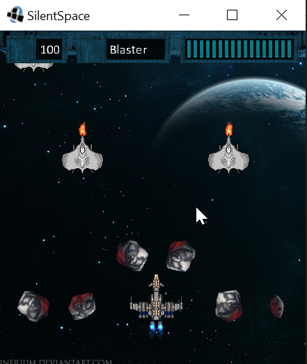

silentspace
===========

## A small LibGDX based game written in Java

A simple experiment in game development. Implemented using plain Java and [LibGDX](https://github.com/libgdx/libgdx) graphics library.

## Requirements
1. Java >= 17
2. Apache Maven

## Running
Build sources using Maven:
```
mvn clean install
```

Execute a jar-with-dependencies using:
```
java -jar silentspace-desktop-app/target/silentspace-desktop-app-<version>-jar-with-dependencies.jar
```

## Screenshots

